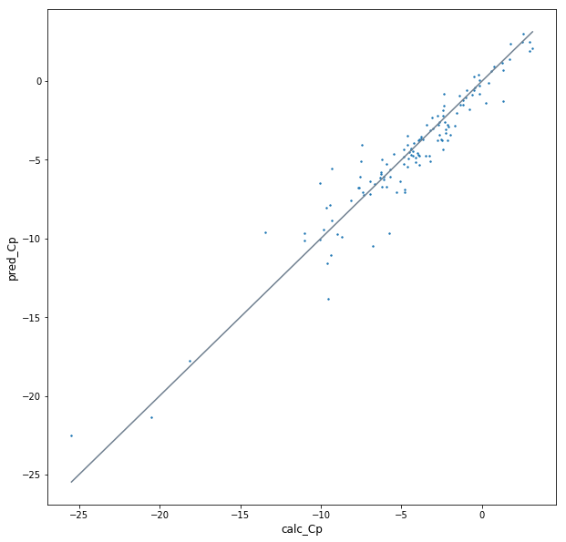

This directory reproduce the method in this paper [Automatic Chemical Design Using a Data-Driven Continuous Representation of Molecules ](https://pubs.acs.org/doi/pdf/10.1021/acscentsci.7b00572) from scratch. 

Applied the method on FreeSolv database (not in the paper) and  the original ZINC database used in the paper. The performance reached expectation. Result of the FreeSolv database is shown below. More analysis in *result_test.ipynb*.

For more about the paper, see my paper notes here [论文笔记：基于SMILES的连续化合物空间](https://zhuanlan.zhihu.com/p/42318383)
