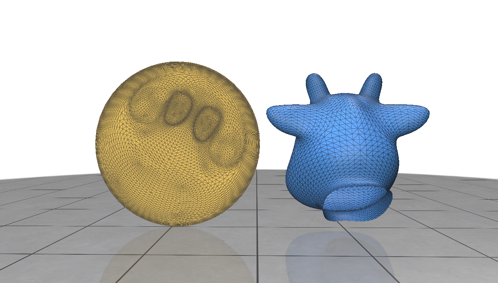

# Stretch Energy Minimization

Implements the Stretch Energy Minimization described in "A Novel Stretch Energy Minimization Algorithm for
Equiareal Parameterizations" https://link.springer.com/article/10.1007/s10915-017-0414-y in C++

snapshot of result shown below:

this repository only includes the src and include file here for backup. It needs to be run using polyscope template from https://github.com/nmwsharp/gc-polyscope-project-template
